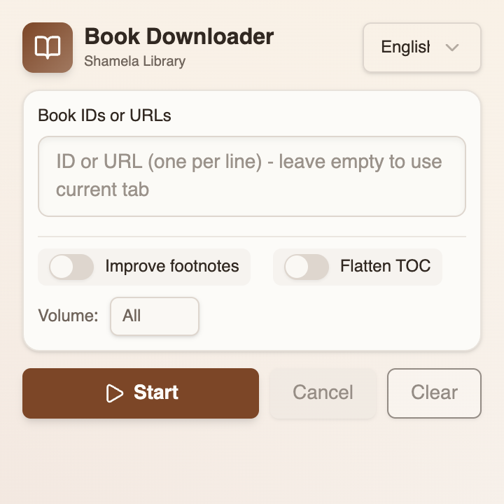

# Shamela EPUB Exporter

> Browser extension to download books from the [Shamela Library](https://shamela.ws) into EPUB files locally.

[](README.md)
[](README.ar.md)




[](https://github.com/ellerbrock/open-source-badges/)
[](https://github.com/yshalsager/shamela-epub-exporter/releases/)
[](https://github.com/yshalsager/shamela-epub-exporter/releases/latest)
[](https://github.com/yshalsager/shamela-epub-exporter/blob/master/LICENSE)

[](https://www.paypal.me/yshalsager)
[](https://liberapay.com/yshalsager)

**Disclaimer:**

* This software is freeware and open source and is only intended for personal or educational use.

## Features

* Creates an [EPUB3](https://www.w3.org/publishing/epub3/epub-spec.html) RTL standard book.
* Automatically adds a page for book information.
* Table of contents with nested chapters (or a flat option).
* Adds volume and page number footer per page.
* Sanitizes book HTML and converts inline colors to CSS classes.
* Optional footnote (hamesh) popup conversion for easier navigation.

## Installation

### Development build (unpacked)

```bash
mise x pnpm -- pnpm run dev
```

Load the extension from:

```bash
.output/chrome-mv3-dev
```

### Production build (unpacked)

```bash
mise x pnpm -- pnpm run build
```

Load the extension from:

```bash
.output/chrome-mv3
```

## Usage

1. Open the extension popup.
2. Paste a book URL or enter a book ID.
3. Click **بدء** and keep the Shamela tab open while it runs.
4. The EPUB downloads automatically when the job finishes.

## Development

This project uses [mise](https://mise.jdx.dev/) for tool versions and environment setup.

1. Install mise.
2. Run `mise install` in the repo root.
3. Start the dev server:

```bash
mise x pnpm -- pnpm run dev
```

## Technology Stack

* TypeScript + Svelte 5 (UI)
* WXT + Vite (extension tooling)
* Tailwind CSS (styles)
* JSZip (EPUB packaging)
* Wuchale (i18n)

## Acknowledgements

This project relies on several open-source tools:

* [Svelte](https://svelte.dev/)
* [WXT](https://wxt.dev/)
* [Vite](https://vitejs.dev/)
* [Tailwind CSS](https://tailwindcss.com/)
* [JSZip](https://stuk.github.io/jszip/)
* [Wuchale](https://github.com/wuchalejs/wuchale)

## Privacy

See `PRIVACY.md`.
